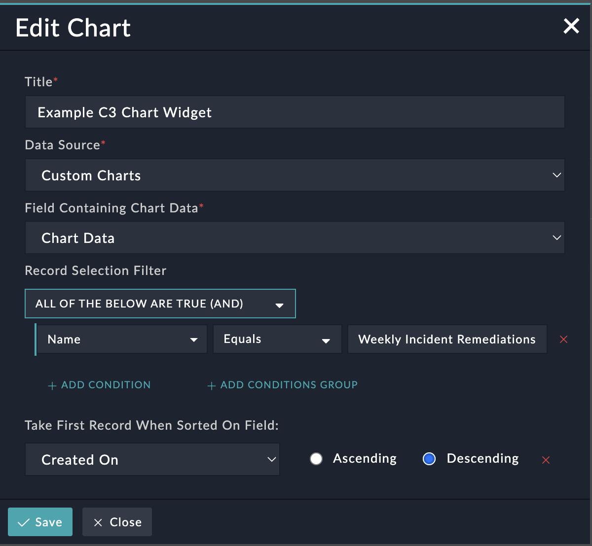

| [Home](../README.md) |
|----------------------|

# Installation

1. To install a solution pack, click **Content Hub** > **Discover**.
2. From the list of solution pack that appears, search for and select **C3 Charts**.
3. Click the **C3 Charts** solution pack card.
4. Click **Install** on the bottom to begin installation.

# Configuration

The C3 Charts widget requires the use of the JSON field in a module to hold the data to be rendered in the resulting chart. For simplicity, a dedicated custom module and field can be used to achieve the same result. The steps to set up such a module are as follows:

1. Navigate to FortiSOAR's **Settings** menu.
2. Click **Modules** under **Application Editor** to access the module editor. By default, the **Create New Module** option is selected.
3. Enter the **Singular Name** for your module, for example *Custom Chart*, to automatically populate the **Plural Name**.
4. Click the **Fields Editor** tab.
5. Add a text field called **Name** and a JSON field called **Chart Data**.
6. Click the **Summary** tab.
7. Select the **Name** field from the **Display Template** drop-down.
7. Click **Save**.
8. Click **Publish** to publish your changes.

## C3 Charts Widget Fields

Provide the following details to customize the **C3 Charts Widget** to suit your requirements:

| Fields                                 | Description                                                                                                                                                                                                                                                                                                                                                      |
|----------------------------------------|------------------------------------------------------------------------------------------------------------------------------------------------------------------------------------------------------------------------------------------------------------------------------------------------------------------------------------------------------------------|
| Title                                  | Specify a title of the rendered chart.                                                                                                                                                                                                                                                                                                     |
| Data Source                            | Select the module which stores the data to be rendered into the chart.|
| Field Containing Chart Data            | Select the field in the above module which contains the chart data in JSON format.                                                                                                                                                                                                                                                                                          |
| Record Selection Filter                | Specify a filter to find and pull the appropriate record for the chart data. For example, to configure this widget to show the most recent record in *Weekly Incident Remediations*, specify the filter `Name Equals Weekly Incident Remediations` fetches th                                                            |
| Take First Record When Sorted On Field | In a case where the filter in the previous parameter results in multiple records being found, they will be sorted on the field specified here, and the first result will be used  as the chart data source. For example, to select the most recent record matching the filter, the Created On field could be selected, along with the "Descending" radio button. |

Once configured, the **Edit Widget** interface should look similar to the following screenshot:

| [Usage](./usage.md) |
|---------------------|
