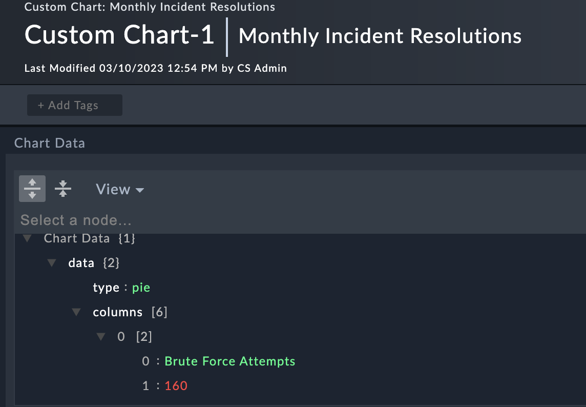
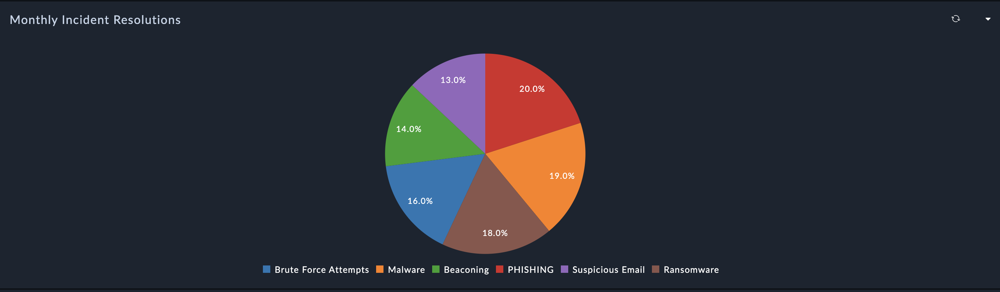

| [Home](../README.md) |
|----------------------|

# Usage

When a dashboard or report containing the **C3 Chart widget** is loaded, the widget queries the module provided in the widget configuration.

This querying retrieves the data from the specified JSON field in the resulting record. This JSON should be structured in such a way that it can be rendered by the C3 Javascript Library. Refer to the [C3 Examples](https://c3js.org/examples.html) and [Reference](https://c3js.org/reference.html) pages for details on what this library can render.

| [Installation](./setup.md#installation) | [Configuration](./setup.md#configuration) |
|-----------------------------------------|-------------------------------------------|
